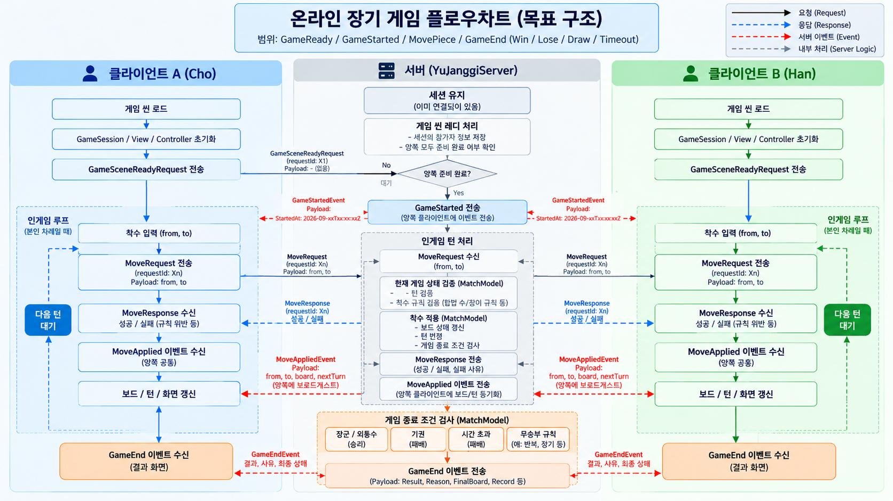
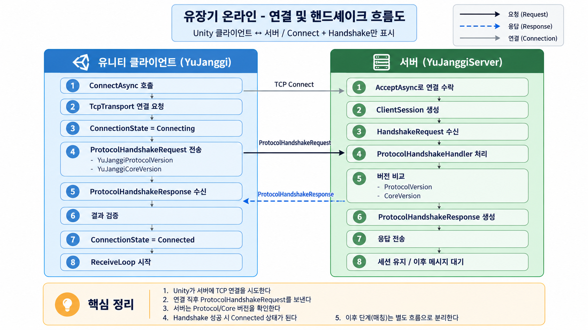
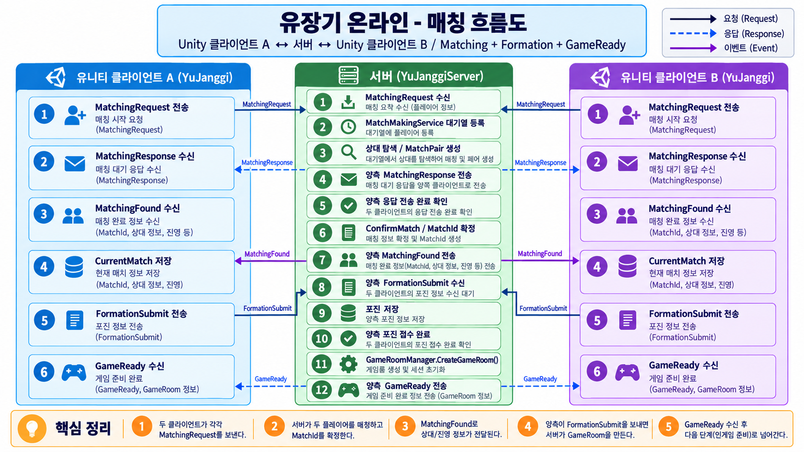
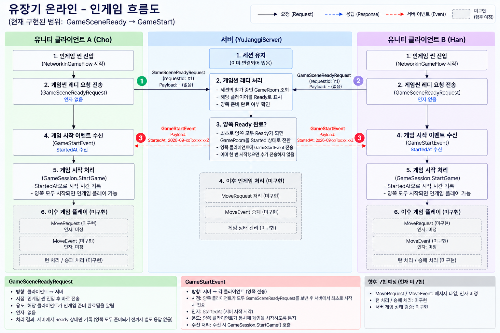

## 📊 GitHub Activity

[](https://github.com/SeokJinYoo98?tab=overview)

최근 31일간의 GitHub 활동입니다.

[](https://github.com/SeokJinYoo98?tab=overview)

[](https://github.com/SeokJinYoo98?tab=repositories)

[전체 기여 기록 보기](https://github.com/SeokJinYoo98?tab=overview) · [저장소 둘러보기](https://github.com/SeokJinYoo98?tab=repositories)
---

# 👋 Yoo Seokjin

### C# / Unity / .NET Developer

Unity 클라이언트 개발에서 시작해 현재는  
**서버 · 네트워크 · 백엔드 구조**까지 개발 범위를 확장하고 있습니다.

기능을 빠르게 추가하는 것보다  
**책임, 데이터 소유권, 실행 흐름을 명확하게 분리하는 구조**에 관심이 많습니다.

---

## 🛠 Tech Stack

### Language


### Engine


### Graphics API

 — King of Tanks Team Project (팀장)  
 — Rendering Framework

### Server / Backend


---

# 🀄 YuJanggi

온라인 장기를 직접 구현하며  
클라이언트, 서버, Protocol, Core의 책임을 분리하고 있는 개인 프로젝트입니다.

초기에는 Unity 내부에 게임 로직이 결합되어 있었지만,  
현재는 게임 규칙과 네트워크 구조를 독립적으로 분리하는 방향으로 발전시키고 있습니다.
## 개발 화면


서버 로그와 두 Unity 클라이언트를 함께 확인하는 개발 화면입니다.

```text
YuJanggi
│
├─ YuJanggi.Unity
│   └─ Unity Client
│
├─ YuJanggi.Server.V2
│   └─ .NET TCP Server
│
├─ YuJanggi.Protocol.V2
│   └─ Client / Server Protocol
│
└─ YuJanggi.Core.V2
    └─ Pure C# Janggi Engine
```

---

# 🌐 Online Architecture

현재 온라인 흐름은 다음 단계까지 구현하고 있습니다.

```text
Connect
→ Protocol Handshake
→ Matching
→ Formation Submit
→ GameRoom 생성
→ GameReady
→ GameSceneReady
→ GameStart
```

현재는 먼저

**Client A ↔ Server ↔ Client B**

통신 구조를 완성하는 데 집중하고 있습니다.

서버 권위형 게임 검증은 이후 단계에서  
`YuJanggi.Core.V2`의 `MatchModel`을 서버 `GameRoom`에 연결하는 방식으로 확장할 예정입니다.

---

# 🎯 Target Architecture

향후 목표는 서버가 실제 대국 상태를 소유하고  
클라이언트의 명령을 검증하는 **Server Authoritative 구조**입니다.



향후 목표 흐름:

```text
Client
   ↓
Move Request
   ↓
Server GameRoom
   ↓
MatchModel
   ↓
Rule Validation
   ↓
Move Applied
   ↓
Both Clients
```

현재 해당 Move / Turn / Timeout / GameEnd 흐름은 아직 구현 전입니다.

---

# 🔄 Current Network Flow

## 1. 연결 및 Protocol Handshake



<details>
<summary><b>상세 흐름 및 Protocol 보기</b></summary>

<br>

Unity 클라이언트가 TCP 서버에 연결한 뒤  
Protocol과 Core 버전을 확인하는 최초 연결 과정입니다.

```text
Unity
→ TCP Connect
→ ProtocolHandshakeRequest

Server
→ Version Check
→ ProtocolHandshakeResponse

Unity
→ Connected
```

</details>

---

## 2. Matching Flow



<details>
<summary><b>상세 흐름 및 Protocol 보기</b></summary>

<br>

두 클라이언트가 매칭을 신청하고  
포진 선택까지 완료하면 서버가 `GameRoom`을 생성합니다.

```text
MatchingRequest
→ MatchingResponse
→ MatchingFound

→ FormationSubmit
→ FormationResponse

→ GameRoom 생성
→ GameReady
```

### 용어 기준

```text
Matching
= 상대를 찾아 게임을 성사시키는 과정

Match
= 성사된 한 대국

MatchId
= 대국 식별자

GameRoom
= 서버에서 두 ClientSession을 묶는 네트워크 룸
```

</details>

---

## 3. InGame Start Flow



<details>
<summary><b>상세 흐름 및 Protocol 보기</b></summary>

<br>

`GameReady` 이후 양쪽 Unity 클라이언트가 게임 씬 준비를 완료하면  
서버가 실제 게임 시작 시점을 동기화합니다.

```text
Client A ─┐
          ├─ GameSceneReadyRequest
Client B ─┘
          ↓
       GameRoom
          ↓
   Both Ready?
          ↓
     Started = true
          ↓
    GameStartEvent
      ↙       ↘
 Client A   Client B
      ↓       ↓
GameSession.StartGame()
```

### 현재 Protocol

```text
GameSceneReadyRequest
- Payload 없음

GameStartEvent
- StartedAt
```

MoveRequest / MoveEvent 및 실제 대국 명령 동기화는  
아직 구현 전입니다.

</details>

---

# 🖥 Server Architecture

현재 서버는 게임 규칙을 직접 실행하지 않고  
네트워크 세션 관리와 메시지 전달 책임에 집중하고 있습니다.

```text
YuJanggiServer
│
├─ MatchingHandler
│   │
│   └─ MatchMakingService
│       │
│       └─ GameRoomManager
│
└─ GameHandler
    │
    └─ GameRoomManager
        │
        └─ GameRoom
            ├─ ChoPlayer
            └─ HanPlayer
```

### Responsibilities

```text
YuJanggiServer
= 서버 생명주기
= ClientMessage → Handler Routing

MatchingHandler
= Matching Protocol 처리

MatchMakingService
= 대기열 및 매칭 성사 과정

GameHandler
= InGame Protocol 처리

GameRoomManager
= GameRoom 생성 / 조회 / 제거 / 수명 관리

GameRoom
= 두 ClientSession
= Ready / Started / Closed 상태
= 참가자 및 상대 조회
```

---

# 🎮 Client Architecture

Unity 클라이언트에서는  
로컬 게임과 네트워크 게임의 시작 흐름을 분리하고 있습니다.

```text
InGameManager
      │
      ▼
  IInGameFlow
   ┌────┴────┐
   │         │
Local      Network
Flow        Flow
   │         │
   │         ├─ GameSceneReadyRequest
   │         │
   │         └─ Wait GameStartEvent
   │
   └───────────────┐
                   ▼
          GameSession.StartGame()
```

네트워크 통신은 다음 역할로 분리하고 있습니다.

```text
NetworkConnection
= 실제 연결과 메시지 수신

RequestDispatcher
= RequestId 기반 Request / Response 처리

MatchingHandler
= Matching 메시지 처리

InGameHandler
= InGame 메시지 처리
```

---

# ⚙ YuJanggi.Core.V2

Unity에 의존하지 않는 순수 C# 장기 엔진입니다.

```text
MatchModel

├─ BoardModel
├─ JanggiRule
├─ Turn
├─ Score
└─ Record
```

클라이언트와 서버가 동일한 규칙 엔진을 사용할 수 있도록  
Unity Runtime과 장기 규칙을 분리했습니다.

향후 서버 권위형 구조에서는:

```text
GameRoom
   ↓
MatchModel
```

형태로 연결할 예정입니다.

---

# 📡 YuJanggi.Protocol.V2

Unity와 .NET 서버가 공유하는 Protocol 프로젝트입니다.

```text
ClientMessage
ServerMessage

Request
Response
Event

Payload DTO
Message Factory
```

게임 엔진과 Protocol을 분리하여  
네트워크 계약이 `YuJanggi.Core.V2` 구현에 직접 의존하지 않도록 구성하고 있습니다.

---

# 🚧 Current Progress

```text
✅ TCP Connection
✅ Protocol Handshake

✅ Matching Request
✅ Matching Cancel
✅ Matching Found

✅ Formation Submit
✅ GameRoom Creation
✅ GameReady

✅ GameSceneReady
✅ GameStart synchronization

🚧 MoveRequest
🚧 MoveEvent
🚧 Turn synchronization
🚧 GameEnd synchronization

⬜ Server Authoritative MatchModel
⬜ Server Turn / Timeout
⬜ Reconnection / State Recovery
⬜ Linux Deployment
```

---
# 🌱 Currently Learning
- ASP.NET Core
- TCP Server Architecture
- Async / Concurrent Server Programming
- Server Authoritative Game Architecture

### 📌 Planned
- Docker
- Linux Deployment
- SQL / MSSQL
- REST API

---

# 💡 Interests

- C# / .NET Server Development
- TCP Network Programming
- Game Server Architecture
- Backend Architecture
- Server Authoritative Design
- Deterministic Turn-Based Game Engine
- Client / Server Shared Core
- ***Maintainable Software Design***

---

# 💭 Development Philosophy

> 기능을 추가하기 전에  
> 누가 상태를 소유하고, 누가 책임을 가지며, 데이터가 어떤 흐름으로 이동하는지를 먼저 고민합니다.

프로젝트를 개발하면서 발생한 문제를 단순히 우회하기보다  
구조를 다시 정의하고 책임을 분리하는 과정을 중요하게 생각합니다.
