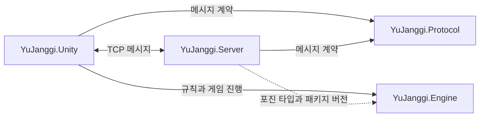

# 👋 Yoo Seokjin

C#과 Unity로 장기 클라이언트를 만들고, .NET 서버와 공용 Protocol·규칙 Engine을 함께 개발하고 있습니다. 상태의 소유권과 처리 순서를 구분하고, 기능별 책임 분리부터 패키징·배포 자동화까지 연결하는 데 관심이 있습니다.


**[GitHub 기여 활동 보기](https://github.com/SeokJinYoo98?tab=overview)** · [전체 저장소 보기](https://github.com/SeokJinYoo98?tab=repositories)

## 기술 스택

| 분야 | 사용 기술 |
| --- | --- |
| 언어 | C#, C++ |
| 게임 개발 | Unity, Unreal Engine |
| 그래픽스 | OpenGL (King of Tanks), DirectX (Rendering Framework) |
| 서버·네트워크 | .NET 10, TCP, async / await |
| 테스트·자동화 | MSTest, GitHub Actions, PowerShell, NuGet, UPM |
| 서버 운영 | AWS EC2, GitHub OIDC, systemd |

## YuJanggi

로컬·AI·온라인 대국을 위한 개인 장기 프로젝트입니다. Client, Server, 메시지 계약, 게임 규칙을 별도 저장소로 구성하고, 공유 라이브러리를 패키지로 제공합니다.


| 프로젝트 | 현재 역할 |
| --- | --- |
| [YuJanggi.Unity](https://github.com/SeokJinYoo98/YuJanggi.Unity) | 로컬·AI 대국, 온라인 매칭·진행·종료, 게임 화면과 리플레이 |
| [YuJanggi.Server](https://github.com/SeokJinYoo98/YuJanggi.Server) | TCP 연결·세션, 매칭·포진, GameRoom 상태, 이동 메시지 전달과 종료 정리 |
| [YuJanggi.Protocol](https://github.com/SeokJinYoo98/YuJanggi.Protocol) | 공유 메시지 계약, RequestId, JSON 직렬화와 길이 기반 Framing |
| [YuJanggi.Engine](https://github.com/SeokJinYoo98/YuJanggi.Engine) | 장기판, 이동 규칙, 턴·점수·기록과 게임 진행 |



Unity는 Engine으로 게임 상태를 처리하고 Protocol로 서버와 통신합니다. 서버도 Engine 패키지를 참조하지만, Engine 기반 이동 검증은 아직 연결하지 않았습니다.

### Client — 게임 진행 방식 분리

Local / AI / Network의 진행 경로를 Flow로 구분합니다. Controller가 입력을 전달하고, Flow가 로컬 적용 또는 서버 요청을 결정하며, GameSession이 Engine과 화면의 생명주기를 연결합니다.

Network에서는 Response와 Event를 구분합니다. 이동은 `MovePieceResponse`의 승인만으로 적용하지 않고 `MovePieceEvent` 수신 후 반영합니다. 종료 결과와 Info 표시도 `GameEndResponse`가 아닌 `GameEndedEvent`를 기준으로 처리합니다.

### Server — 기능별 구조와 공유 계약

`Features/Login`, `Features/Lobby`, `Features/Game`을 기능 흐름 단위로 구성하고 다음 책임 규칙을 적용했습니다.

```text
Handler → Service → Manager → Domain Object
```

- **Handler**: Protocol 요청 해석·검증, Response / Event 생성과 전송
- **Service**: 유스케이스 판단과 상태 변경 조정
- **Manager**: 컬렉션 등록·조회·제거와 동시성 보호
- **Domain Object**: 기능별 상태와 무결성 유지

이 구분을 공통 상속 계층으로 강제하지 않습니다. 실제 공유 계약인 `IMessageHandler`, `IClientSession`과 RequestId 검증만 Core에 두고, TCP 송수신은 Transport, 연결·세션 생명주기는 Connection에 유지합니다.

Lobby는 매칭과 포진 준비를 담당하고, GameRoom 생성 이후의 준비·종료 상태와 정리는 Game이 담당합니다. Login에는 Handshake와 인증 사용자 연결을 위한 기본 구조가 있으며, 실제 자격 증명 검증과 로그인 기능은 아직 구현하지 않았습니다.

### 온라인 대국 흐름

```text
TCP 연결 → 버전 Handshake → 매칭 → 양측 포진 제출
→ GameReadyEvent → 양측 GameSceneReady → GameStartEvent
→ MovePieceRequest / Response / Event
→ 양측 GameEndRequest → GameEndResponse → GameEndedEvent
→ Room 종료·제거
```

양측 매칭 Response가 전송된 후 MatchingFound를 보내고, 양측 게임 씬 준비가 완료된 후 시작 이벤트를 보냅니다. 종료는 양측의 승자·수순 제출값이 일치할 때 확정하며, 확정 이후 전송 실패가 발생해도 Room 정리를 수행합니다.

## 패키징과 CI/CD

### Protocol / Engine — 동일 소스의 NuGet·UPM 배포

.NET과 Unity에서 같은 원본 코드를 사용하도록 NuGet 라이브러리와 UPM 소스 패키지를 생성합니다. Tag 버전을 `Version.cs`, `.csproj`, `upm/package.json`에 함께 적용하고, 실제 Compile Item을 기준으로 UPM Runtime 소스를 준비합니다.

```text
PR → CI: Restore / Build / Test

Tag → Release: Version 설정 → Restore / Build / Test
    → NuGet .nupkg + UPM .tgz → Actions Artifact
    → GitHub Release 생성: NuGet 파일 첨부

Release 성공 → CD: 동일 Run의 NuGet Artifact 다운로드
            → GITHUB_TOKEN 인증 → GitHub Packages Publish
```

`workflowConfig.json`에서 프로젝트별 Target, 솔루션 경로, 도구 버전과 Artifact 이름을 분리합니다. 버전 변경·패키징 로직은 스크립트가 담당하고 Workflow가 실행 순서를 조정합니다. CD에서는 검증한 NuGet 패키지를 다시 Build하지 않고 Publish합니다.

NuGet은 GitHub Packages에서 참조합니다. UPM은 현재 Actions Artifact의 `.tgz`를 다운로드해 Unity에 설치하며 Registry Publish는 하지 않습니다. Runner에서 생성한 결과가 로컬 폴더나 Git Tag의 파일을 자동으로 갱신하지 않는다는 점도 배포 방식에 반영했습니다.

### Server — Linux Artifact와 EC2 배포

```text
PR → Server CI: Restore / Build / Test

Tag → Server Release: Restore / Build / Test
    → Linux x64 Publish → 배포 Artifact

Release 성공 → Server CD: 동일 Run의 Artifact 다운로드
            → GitHub OIDC로 AWS Role Assume
            → Runner 공인 IP/32에 SSH 임시 허용
            → SCP 배포 → systemd 재시작·active 확인
            → 생성한 SSH Rule ID 제거
```

Release는 배포 결과물 생성, CD는 EC2 배포를 담당합니다. 장기 AWS Access Key 대신 OIDC를 사용하며, SSH Host Key 검증을 유지합니다. Security Group은 기존 규칙을 변경하지 않고 이번 실행에서 생성한 규칙만 제거합니다.

배포 후 서비스의 실행 DLL·시작 시각과 Engine / Protocol 버전 로그를 확인했습니다. Runner 강제 종료 시 임시 규칙 정리와 배포 실패 시 자동 롤백은 별도 보완이 필요한 영역입니다.

## 테스트와 현재 범위

Engine은 기물 이동·합법성·포획·무르기·턴·기록을, Protocol은 메시지 왕복·RequestId·Framing을 MSTest로 검증합니다. Server 테스트는 Connection / Lobby / Game으로 분류해 연결 정리, 매칭 동시성, Response → Event 순서와 Room 정리를 검사합니다.

로컬 네트워크에서 매칭부터 이동·종료·Room 제거까지 한 사이클을 확인했고, GitHub Actions를 통한 EC2 배포와 서비스 재시작도 확인했습니다. 서버 자체의 Engine 기반 이동·최종 결과 검증, 사용자 인증, 재접속 복구는 아직 구현된 기능으로 간주하지 않습니다.

상세 코드, 사용 방법과 구현 범위는 각 프로젝트의 README에서 확인할 수 있습니다.
