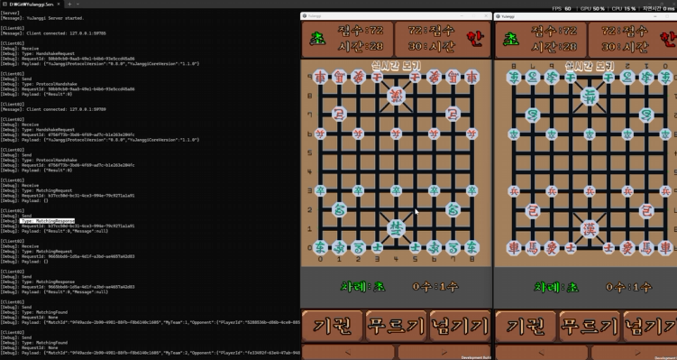

# 👋 Yoo Seokjin

C#과 Unity로 장기 클라이언트를 만들고, .NET 서버와 공용 프로토콜·규칙 엔진을 함께 개발하고 있습니다. 각 프로젝트에서 상태를 누가 소유하고 어떤 순서로 처리하는지 명확히 하는 데 관심이 있습니다.


**[GitHub 기여 활동 보기](https://github.com/SeokJinYoo98?tab=overview)** · [전체 저장소 보기](https://github.com/SeokJinYoo98?tab=repositories)

## 기술 스택

| 분야 | 사용 기술 |
| --- | --- |
| 언어 | C#, C++ |
| 게임 개발 | Unity, Unreal Engine |
| 그래픽스 | OpenGL (King of Tanks), DirectX (Rendering Framework) |
| 서버·네트워크 | .NET, TCP |

## YuJanggi

로컬·AI·온라인 대국을 위한 개인 장기 프로젝트입니다. Unity 클라이언트, .NET 서버, 통신 Protocol, 장기 Engine을 별도 저장소로 구성했습니다.



| 프로젝트 | 현재 역할 |
| --- | --- |
| [YuJanggi.Unity](https://github.com/SeokJinYoo98/YuJanggi.Unity) | 로컬·AI 대국, 온라인 매칭, 게임 화면과 리플레이 |
| [YuJanggi.Server.V2](https://github.com/SeokJinYoo98/YuJanggi.Server.V2) | TCP 연결, 매칭, 포진 접수, GameRoom 준비와 시작 알림 |
| [YuJanggi.Protocol](https://github.com/SeokJinYoo98/YuJanggi.Protocol) | 클라이언트·서버 공용 메시지, DTO, 직렬화와 패킷 길이 처리 |
| [YuJanggi.Engine](https://github.com/SeokJinYoo98/YuJanggi.Engine) | 장기판, 이동 규칙, 턴·점수·기록 관리 |

### 현재 온라인 흐름

```text
TCP 연결 → 버전 Handshake → 매칭 → 포진 제출
→ GameReady → 양쪽 GameSceneReady → GameStartEvent
```

## NuGet / UPM 패키징 자동화 ⭐⭐⭐

기존에는 패키지 버전 변경 시 다음 작업을 수동으로 반복했습니다.

```text
버전 입력
    ↓
코드 버전 변경
    ↓
.csproj 변경
    ↓
package.json 변경
    ↓
dotnet pack
    ↓
UPM 생성
```
이를 Upm_Nuget_Version_Change.bat 파일로 자동화했습니다.


개선 결과
- 반복적인 패키징 작업 단순화
- 버전 변경 누락 가능성 감소
- NuGet / UPM 버전 불일치 방지
- 배포 절차 일관성 확보


서버는 양쪽 클라이언트의 게임 화면 준비를 확인한 뒤 시작 이벤트를 보냅니다. 서버에서 기물 이동 요청을 검증하고 두 클라이언트에 동기화하는 처리는 아직 연결되어 있지 않습니다.

구현 범위와 코드는 위 프로젝트별 README에서 확인할 수 있습니다.
